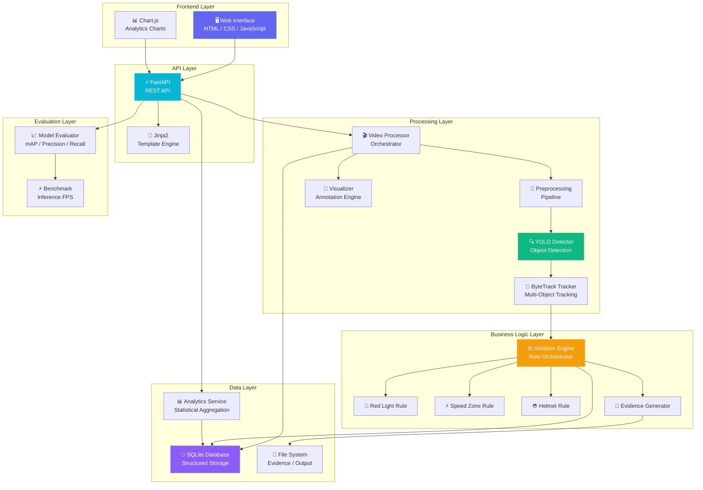

# System Architecture Diagram

```mermaid
graph TB
    subgraph "Frontend Layer"
        UI["🖥️ Web Interface\nHTML / CSS / JavaScript"]
        Charts["📊 Chart.js\nAnalytics Charts"]
    end

    subgraph "API Layer"
        API["⚡ FastAPI\nREST API"]
        Templates["📄 Jinja2\nTemplate Engine"]
    end

    subgraph "Processing Layer"
        VP["🎬 Video Processor\nOrchestrator"]
        PP["🔧 Preprocessing\nPipeline"]
        DET["🔍 YOLO Detector\nObject Detection"]
        TRK["🎯 ByteTrack Tracker\nMulti-Object Tracking"]
        VIS["🎨 Visualizer\nAnnotation Engine"]
    end

    subgraph "Business Logic Layer"
        VE["⚖️ Violation Engine\nRule Orchestrator"]
        RL["🔴 Red Light Rule"]
        SZ["⚡ Speed Zone Rule"]
        HM["⛑️ Helmet Rule"]
        EG["📸 Evidence Generator"]
    end

    subgraph "Data Layer"
        AN["📊 Analytics Service\nStatistical Aggregation"]
        DB["💾 SQLite Database\nStructured Storage"]
        FS["📁 File System\nEvidence / Output"]
    end

    subgraph "Evaluation Layer"
        EV["📈 Model Evaluator\nmAP / Precision / Recall"]
        BM["⚡ Benchmark\nInference FPS"]
    end

    UI --> API
    Charts --> API
    API --> Templates
    API --> VP
    API --> AN
    API --> EV

    VP --> PP --> DET --> TRK
    TRK --> VE
    VE --> RL
    VE --> SZ
    VE --> HM
    VE --> EG

    VP --> VIS
    EG --> FS
    VP --> DB
    VE --> DB
    AN --> DB
    EV --> BM

    style UI fill:#6366f1,stroke:#6366f1,color:#fff
    style API fill:#06b6d4,stroke:#06b6d4,color:#fff
    style DET fill:#10b981,stroke:#10b981,color:#fff
    style VE fill:#f59e0b,stroke:#f59e0b,color:#fff
    style DB fill:#8b5cf6,stroke:#8b5cf6,color:#fff
```
