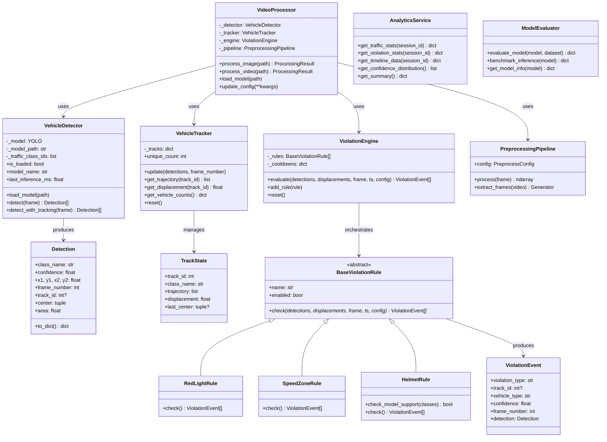

# Component / Class Diagram

```mermaid
classDiagram
    class VehicleDetector {
        -_model: YOLO
        -_model_path: str
        -_traffic_class_ids: list
        +load_model(path)
        +detect(frame) Detection[]
        +detect_with_tracking(frame) Detection[]
        +is_loaded: bool
        +model_name: str
        +last_inference_ms: float
    }

    class Detection {
        +class_name: str
        +confidence: float
        +x1, y1, x2, y2: float
        +frame_number: int
        +track_id: int?
        +center: tuple
        +area: float
        +to_dict() dict
    }

    class VehicleTracker {
        -_tracks: dict
        +update(detections, frame_number)
        +unique_count: int
        +get_trajectory(track_id) list
        +get_displacement(track_id) float
        +get_vehicle_counts() dict
        +reset()
    }

    class TrackState {
        +track_id: int
        +class_name: str
        +trajectory: list
        +displacement: float
        +last_center: tuple?
    }

    class BaseViolationRule {
        <<abstract>>
        +name: str*
        +enabled: bool*
        +check(detections, displacements, frame, ts, config) ViolationEvent[]*
    }

    class RedLightRule {
        +check() ViolationEvent[]
    }

    class SpeedZoneRule {
        +check() ViolationEvent[]
    }

    class HelmetRule {
        +check_model_support(classes) bool
        +check() ViolationEvent[]
    }

    class ViolationEngine {
        -_rules: BaseViolationRule[]
        -_cooldowns: dict
        +evaluate(detections, displacements, frame, ts, config) ViolationEvent[]
        +add_rule(rule)
        +reset()
    }

    class ViolationEvent {
        +violation_type: str
        +track_id: int?
        +vehicle_type: str
        +confidence: float
        +frame_number: int
        +detection: Detection
    }

    class VideoProcessor {
        -_detector: VehicleDetector
        -_tracker: VehicleTracker
        -_engine: ViolationEngine
        -_pipeline: PreprocessingPipeline
        +process_image(path) ProcessingResult
        +process_video(path) ProcessingResult
        +load_model(path)
        +update_config(**kwargs)
    }

    class PreprocessingPipeline {
        +config: PreprocessConfig
        +process(frame) ndarray
        +extract_frames(video) Generator
    }

    class AnalyticsService {
        +get_traffic_stats(session_id) dict
        +get_violation_stats(session_id) dict
        +get_timeline_data(session_id) dict
        +get_confidence_distribution() list
        +get_summary() dict
    }

    class ModelEvaluator {
        +evaluate_model(model, dataset) dict
        +benchmark_inference(model) dict
        +get_model_info(model) dict
    }

    VehicleDetector --> Detection : produces
    VehicleTracker --> TrackState : manages
    VideoProcessor --> VehicleDetector : uses
    VideoProcessor --> VehicleTracker : uses
    VideoProcessor --> ViolationEngine : uses
    VideoProcessor --> PreprocessingPipeline : uses
    ViolationEngine --> BaseViolationRule : orchestrates
    BaseViolationRule <|-- RedLightRule
    BaseViolationRule <|-- SpeedZoneRule
    BaseViolationRule <|-- HelmetRule
    BaseViolationRule --> ViolationEvent : produces
```
