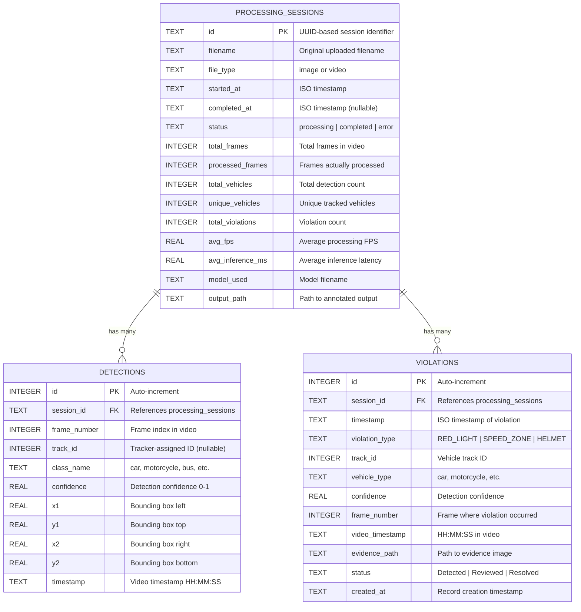

# Entity-Relationship Diagram

```mermaid
erDiagram
    PROCESSING_SESSIONS {
        TEXT id PK "UUID-based session identifier"
        TEXT filename "Original uploaded filename"
        TEXT file_type "image or video"
        TEXT started_at "ISO timestamp"
        TEXT completed_at "ISO timestamp (nullable)"
        TEXT status "processing | completed | error"
        INTEGER total_frames "Total frames in video"
        INTEGER processed_frames "Frames actually processed"
        INTEGER total_vehicles "Total detection count"
        INTEGER unique_vehicles "Unique tracked vehicles"
        INTEGER total_violations "Violation count"
        REAL avg_fps "Average processing FPS"
        REAL avg_inference_ms "Average inference latency"
        TEXT model_used "Model filename"
        TEXT output_path "Path to annotated output"
    }

    DETECTIONS {
        INTEGER id PK "Auto-increment"
        TEXT session_id FK "References processing_sessions"
        INTEGER frame_number "Frame index in video"
        INTEGER track_id "Tracker-assigned ID (nullable)"
        TEXT class_name "car, motorcycle, bus, etc."
        REAL confidence "Detection confidence 0-1"
        REAL x1 "Bounding box left"
        REAL y1 "Bounding box top"
        REAL x2 "Bounding box right"
        REAL y2 "Bounding box bottom"
        TEXT timestamp "Video timestamp HH:MM:SS"
    }

    VIOLATIONS {
        INTEGER id PK "Auto-increment"
        TEXT session_id FK "References processing_sessions"
        TEXT timestamp "ISO timestamp of violation"
        TEXT violation_type "RED_LIGHT | SPEED_ZONE | HELMET"
        INTEGER track_id "Vehicle track ID"
        TEXT vehicle_type "car, motorcycle, etc."
        REAL confidence "Detection confidence"
        INTEGER frame_number "Frame where violation occurred"
        TEXT video_timestamp "HH:MM:SS in video"
        TEXT evidence_path "Path to evidence image"
        TEXT status "Detected | Reviewed | Resolved"
        TEXT created_at "Record creation timestamp"
    }

    PROCESSING_SESSIONS ||--o{ DETECTIONS : "has many"
    PROCESSING_SESSIONS ||--o{ VIOLATIONS : "has many"
```
