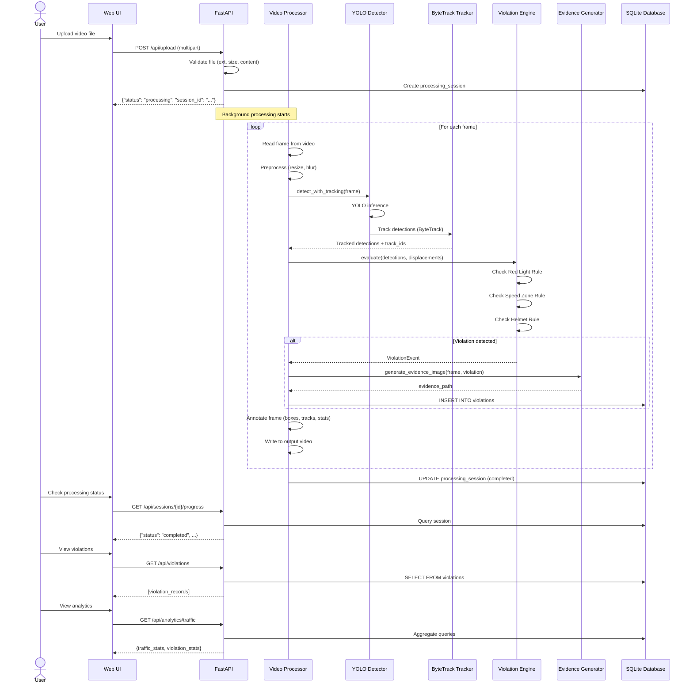

# Sequence Diagram

```mermaid
sequenceDiagram
    actor User
    participant UI as Web UI
    participant API as FastAPI
    participant VP as Video Processor
    participant DET as YOLO Detector
    participant TRK as ByteTrack Tracker
    participant VE as Violation Engine
    participant EG as Evidence Generator
    participant DB as SQLite Database

    User->>UI: Upload video file
    UI->>API: POST /api/upload (multipart)
    API->>API: Validate file (ext, size, content)
    API->>DB: Create processing_session
    API-->>UI: {"status": "processing", "session_id": "..."}

    Note over API,VP: Background processing starts

    loop For each frame
        VP->>VP: Read frame from video
        VP->>VP: Preprocess (resize, blur)
        VP->>DET: detect_with_tracking(frame)
        DET->>DET: YOLO inference
        DET->>TRK: Track detections (ByteTrack)
        TRK-->>VP: Tracked detections + track_ids

        VP->>VE: evaluate(detections, displacements)
        VE->>VE: Check Red Light Rule
        VE->>VE: Check Speed Zone Rule
        VE->>VE: Check Helmet Rule

        alt Violation detected
            VE-->>VP: ViolationEvent
            VP->>EG: generate_evidence_image(frame, violation)
            EG-->>VP: evidence_path
            VP->>DB: INSERT INTO violations
        end

        VP->>VP: Annotate frame (boxes, tracks, stats)
        VP->>VP: Write to output video
    end

    VP->>DB: UPDATE processing_session (completed)

    User->>UI: Check processing status
    UI->>API: GET /api/sessions/{id}/progress
    API->>DB: Query session
    API-->>UI: {"status": "completed", ...}

    User->>UI: View violations
    UI->>API: GET /api/violations
    API->>DB: SELECT FROM violations
    API-->>UI: [violation_records]

    User->>UI: View analytics
    UI->>API: GET /api/analytics/traffic
    API->>DB: Aggregate queries
    API-->>UI: {traffic_stats, violation_stats}
```
