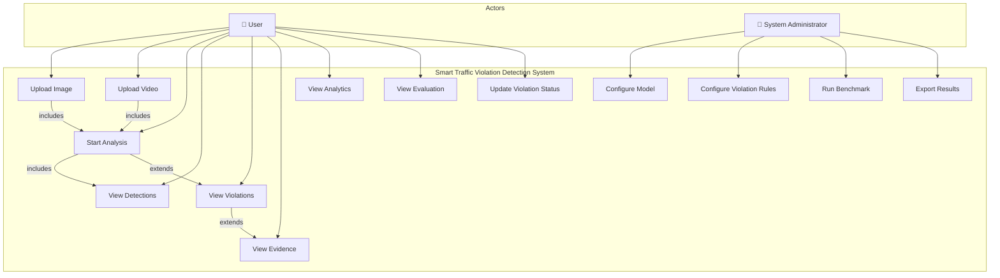

# Use Case Diagram

```mermaid
graph TB
    subgraph Actors
        User["👤 User"]
        Admin["🔧 System Administrator"]
    end

    subgraph "Smart Traffic Violation Detection System"
        UC1["Upload Image"]
        UC2["Upload Video"]
        UC3["Start Analysis"]
        UC4["View Detections"]
        UC5["View Violations"]
        UC6["View Evidence"]
        UC7["View Analytics"]
        UC8["View Evaluation"]
        UC9["Configure Model"]
        UC10["Configure Violation Rules"]
        UC11["Update Violation Status"]
        UC12["Run Benchmark"]
        UC13["Export Results"]
    end

    User --> UC1
    User --> UC2
    User --> UC3
    User --> UC4
    User --> UC5
    User --> UC6
    User --> UC7
    User --> UC8
    User --> UC11

    Admin --> UC9
    Admin --> UC10
    Admin --> UC12
    Admin --> UC13

    UC1 -->|includes| UC3
    UC2 -->|includes| UC3
    UC3 -->|includes| UC4
    UC3 -->|extends| UC5
    UC5 -->|extends| UC6
```
