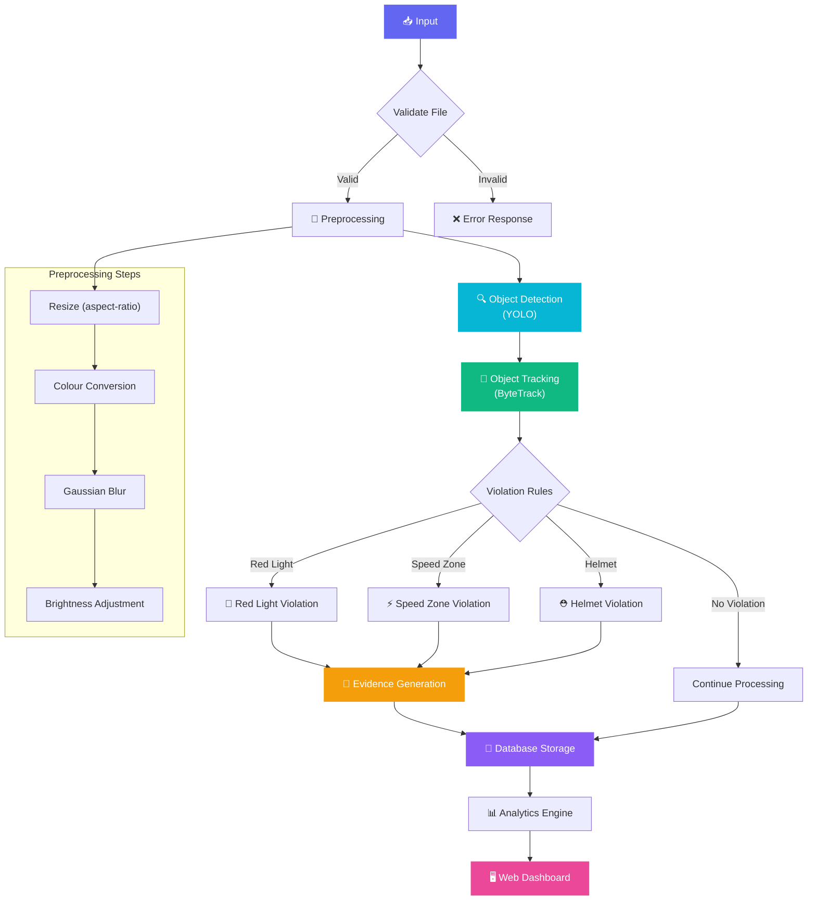

# Workflow Diagram

```mermaid
flowchart TD
    A["📥 Input"] --> B{"Validate File"}
    B -->|Valid| C["🔧 Preprocessing"]
    B -->|Invalid| E1["❌ Error Response"]

    C --> D["🔍 Object Detection\n(YOLO)"]
    D --> F["🎯 Object Tracking\n(ByteTrack)"]
    F --> G{"Violation Rules"}

    G -->|Red Light| H1["🔴 Red Light Violation"]
    G -->|Speed Zone| H2["⚡ Speed Zone Violation"]
    G -->|Helmet| H3["⛑️ Helmet Violation"]
    G -->|No Violation| I["Continue Processing"]

    H1 --> J["📸 Evidence Generation"]
    H2 --> J
    H3 --> J

    J --> K["💾 Database Storage"]
    I --> K

    K --> L["📊 Analytics Engine"]
    L --> M["🖥️ Web Dashboard"]

    subgraph "Preprocessing Steps"
        C1["Resize (aspect-ratio)"]
        C2["Colour Conversion"]
        C3["Gaussian Blur"]
        C4["Brightness Adjustment"]
    end
    C --> C1 --> C2 --> C3 --> C4

    style A fill:#6366f1,stroke:#6366f1,color:#fff
    style D fill:#06b6d4,stroke:#06b6d4,color:#fff
    style F fill:#10b981,stroke:#10b981,color:#fff
    style J fill:#f59e0b,stroke:#f59e0b,color:#fff
    style K fill:#8b5cf6,stroke:#8b5cf6,color:#fff
    style M fill:#ec4899,stroke:#ec4899,color:#fff
```
